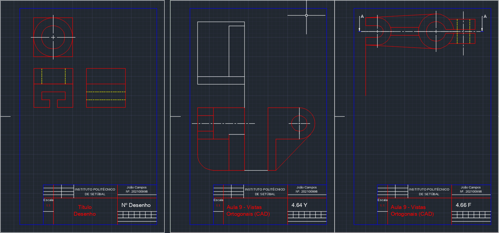
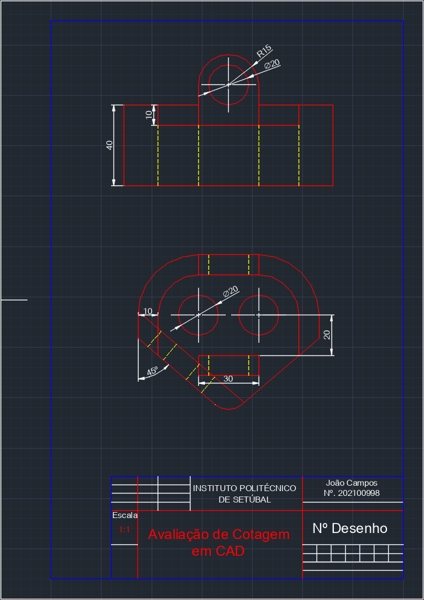
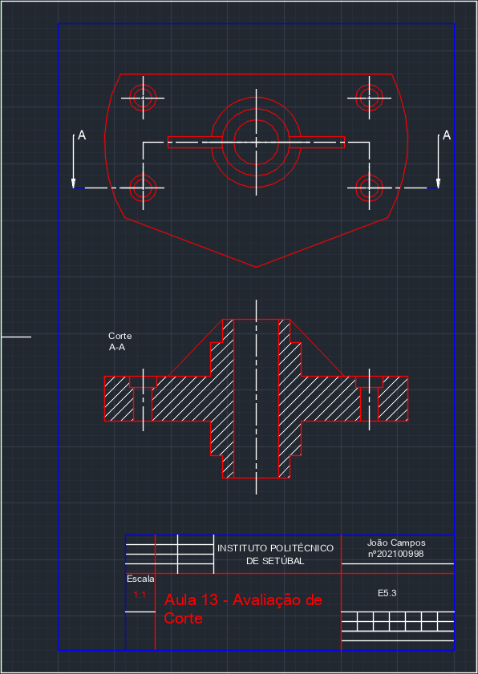
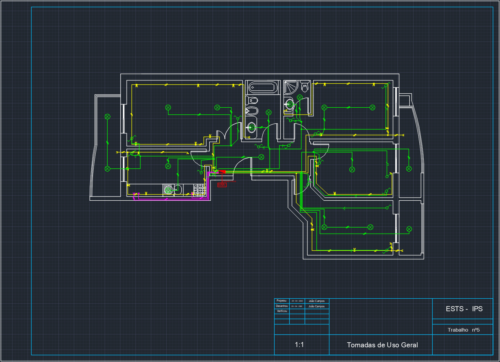
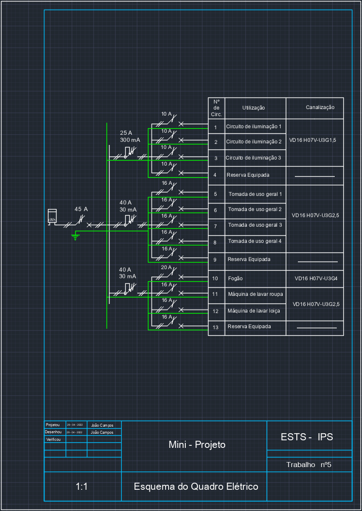
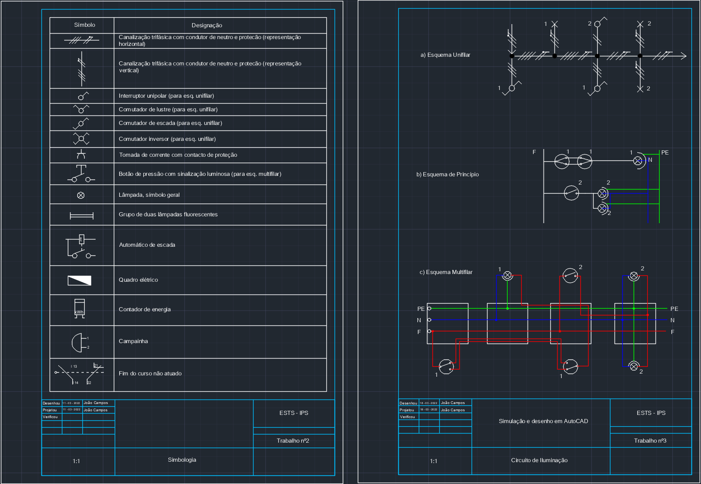

# Technical Drawing and Electrical Schematics

[Versão Portuguesa](README.md)

This repository contains visual materials and a structured summary of the skills developed in two course units: **General / Technical Drawing (DG)** and **Electrical Equipment & Schematics (EEE)**. Its purpose is to document the concepts and skills acquired.

## Technical Drawing ("General Drawing")

The class focused on the **interpretation and production of technical drawings**, distinguishing them from artistic drawing, and covered **orthographic projections, sections (cuts), rapid freehand perspectives**, and **standardized dimensioning**. An initial exposure to **2D CAD software** introduced basic organization and preliminary parametric concepts.

Core skills included **3D‑to‑2D spatial visualization**, **technical sketching for communication**, **consistent application of graphical standards**, and **symbolic representation of building service networks** (HVAC, water, air) within an architectural context.

Topics covered: technical drawing standards, projections, cuts and sections, perspectives, dimensioning techniques and selection criteria, architectural/network symbolism, and an introduction to computer‑aided drafting (CAD).

### Images (Technical Drawing)

   
  <em>Initial exercise in orthographic projections and multiple views.</em>

<table>
  <tr>
    <td align="center" width="50%">
       
      <em>Progression of views with standardized dimensioning and alignment.</em>
    </td>
    <td align="center" width="50%">
       
      <em>Introduction to sections (cuts).</em>
    </td>
  </tr>
</table>

   
  <em>Architectural plan showing schematic HVAC / building services routing.</em>

## EEE (Electrical Equipment & Schematics)

This class emphasized the **interpretation, modification, and digitization of electrical schematics** (principle, multi‑line, and single‑line), introducing the use of **CAD / AutoCAD** and **standardized electrical symbols**. It covered **electrical installations, control and protection devices, motor power circuits, automation basics, and circuit simulation**.

Skills developed included **translation between multi‑line and single‑line diagrams**, **selection of suitable control and protection devices**, **interpretation of lighting and power circuits**, **design of signaling and interlocking schemes**, and **structuring motor starting circuits** while distinguishing power from control logic.

Topics covered: introduction to CAD, electrical symbols and standards, lighting and socket circuits, signaling, sensors, auxiliary contacts, interlocks and sequences, and motor power systems (contactors and starting methods).

### Images (EEE)

   
  <em>Initial lab assembly of a basic lighting circuit with device testing.</em>

   
  <em>Continued assembly adding control and protection devices.</em>

   
  <em>Functional verification and physical organization of conductors.</em>

   
  <em>Floor plan showing distribution of sockets and lighting points.</em>

   
  <em>Electrical distribution board: arrangement of protective devices and branch circuits.</em>

   
  <em>Electrical symbol reference and example lighting circuit.</em>

## Cross‑Disciplinary Integration

| Aspect          | Technical Drawing                                | EEE                                        | Synergy                                         |
| --------------- | ------------------------------------------------ | ------------------------------------------ | ----------------------------------------------- |
| Standardization | Lines, cuts, dimensioning, architectural symbols | Electrical symbols, quantity notations     | Multidisciplinary document consistency          |
| Representation  | Projections, perspectives, sections              | Schematics (principle, multi‑line, single) | Mapping between physical object and function    |
| CAD             | Layout, layers, scales                           | Electrical diagrams, schematic sheets      | Shared digital environment and interoperability |
| Symbolism       | HVAC / water / air networks                      | Devices, protections, signaling            | Graphic coherence of technical systems          |
| Visualization   | Space and volumetry                              | Electrical flow and control logic          | Improved design development and review          |

The learning path merged **spatial representation fundamentals** and **normative rigor** with the **functional logic of electrical systems**, fostering a holistic technical perspective valuable in engineering collaboration.
