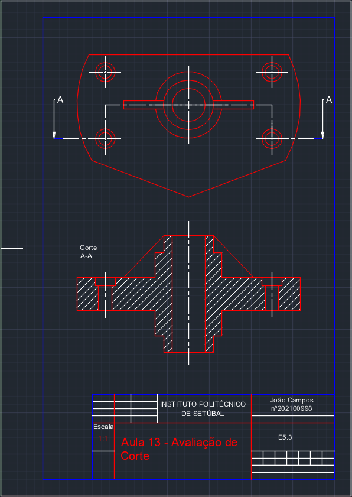
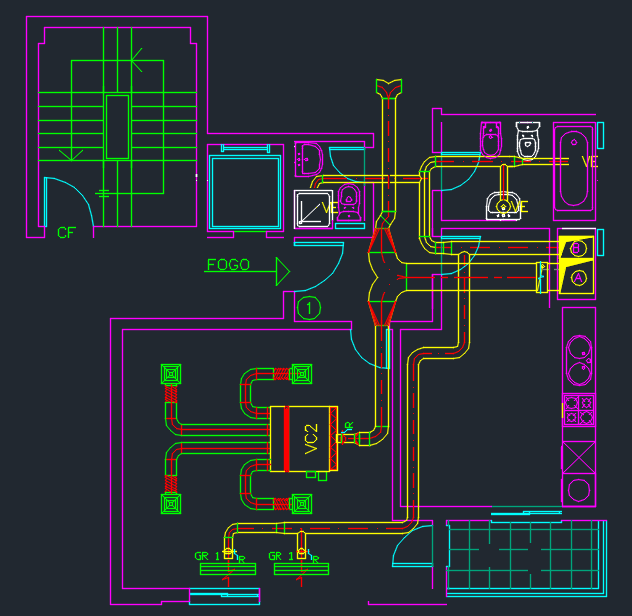

# Desenho Técnico e Esquemas Elétricos

[English Version](README.en.md)

Este repositório reúne materiais visuais e um resumo das competências desenvolvidas em duas unidades curriculares: **Desenho Geral (DG)** e **Equipamentos e Esquemas Elétricos (EEE)**. O objetivo deste README é documentar o que foi aprendido.

## Desenho Técnico ("Desenho Geral")

A disciplina trabalhou a **interpretação e produção de desenhos técnicos**, distinguindo-os do desenho artístico, incluindo **projeções ortogonais, cortes, secções, perspetivas rápidas** e **cotagem normalizada**. Foi introduzido o **uso de software CAD 2D**, com noções básicas de organização e parametrização.

As principais competências desenvolvidas foram a **visualização espacial em 3D**, a **comunicação técnica através de esboços**, a **aplicação de normas gráficas** e a **representação simbólica de redes técnicas** (como AVAC, água e ar).

Os conteúdos abordados incluíram: normas do desenho técnico, projeções, cortes e secções, perspetivas, técnicas de cotagem, simbologia aplicada à arquitetura/engenharia e introdução ao desenho assistido por computador (CAD).

### Imagens (Desenho Técnico)

   
  <em>Exercício de projeções ortogonais / vistas múltiplas iniciais.</em>

<table>
  <tr>
    <td align="center" width="50%">
       
      <em>Evolução de vistas com aplicação de cotagem e alinhamento.</em>
    </td>
    <td align="center" width="50%">
       
      <em>Introdução a cortes/secções.</em>
    </td>
  </tr>
</table>

   
  <em>Planta arquitetónica com traçado esquemático de instalação AVAC / redes técnicas.</em>

## EEE (Equipamentos e Esquemas Elétricos)

A disciplina focou-se na **interpretação, modificação e digitalização de esquemas elétricos** (princípio, multifilar e unifilar), introduzindo o uso de **CAD/AutoCAD** e a **simbologia normalizada**. Foram abordados conceitos de **instalações elétricas, aparelhagem de comando, proteção, força motriz, automatismos e simulação de circuitos**.

As competências desenvolvidas incluíram a **transição entre esquemas multifilar e unifilar**, a **seleção de dispositivos adequados de comando e proteção**, a **interpretação de circuitos de iluminação e força motriz**, a **conceção de esquemas de sinalização** e a **estruturação de circuitos de arranque de motores** distinguindo potência e comando.

Os conteúdos abordados foram: introdução ao CAD, simbologia elétrica, circuitos de iluminação e tomadas, sinalização e encravamentos, e força motriz com diferentes métodos de arranque de motores.

### Imagens (EEE)

   
  <em>Montagem laboratorial inicial de circuito de iluminação / teste de aparelhagem.</em>

   
  <em>Continuação de montagem com inclusão de dispositivos de comando / proteção.</em>

   
  <em>Verificação funcional e organização física dos condutores.</em>

   
  <em>Planta com distribuição de tomadas e pontos de luz.</em>

   
  <em>Quadro elétrico: organização de proteções e circuitos derivados.</em>

   
  <em>Tabela de simbologia elétrica e exemplo de circuito de iluminação.</em>

## Integração Entre Disciplinas

| Aspeto        | Desenho Técnico                                   | EEE                                        | Sinergia                                    |
| ------------- | ------------------------------------------------- | ------------------------------------------ | ------------------------------------------- |
| Normalização  | Linhas, cortes, cotagem, simbologia arquitetónica | Símbolos elétricos, notações de grandezas  | Consistência documental multidisciplinar    |
| Representação | Projeções, perspetivas, secções                   | Esquemas (princípio, multifilar, unifilar) | Tradução entre objeto físico e funcional    |
| CAD           | Layout, layers, escalas                           | Diagramas elétricos, folhas esquemáticas   | Ambiente digital partilhado e interoperável |
| Simbologia    | Redes AVAC / água / ar                            | Aparelhagem, proteções, sinalização        | Coerência gráfica de sistemas técnicos      |
| Visualização  | Espaço e volumetria                               | Fluxo elétrico e lógica de comando         | Melhoria da conceção e revisão de projetos  |

A aprendizagem combinou fundamentos de **representação espacial** e **rigor normativo** com a **lógica funcional de sistemas elétricos**.
